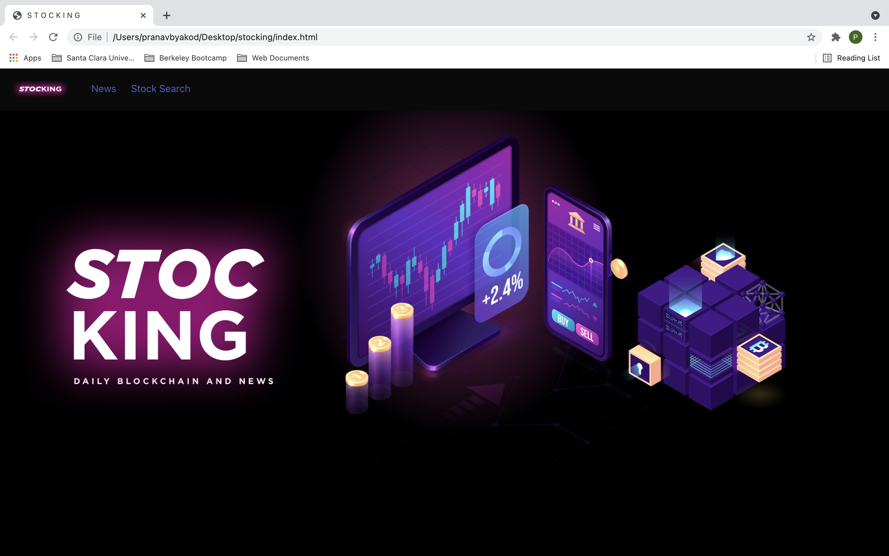

# Stocking: The Daily Blockchain and News Hub

## Deployed Link

Placeholder Link

## Short Description

This multi-functional website provides users with quick and up-to-date stock information, as well as the latest news around the world. Users who wish to view the stock trend of a particular company can do so at the click of a button, while also catching up on financial updates happening across the economy. 

## Screenshot of Website

## Website Functionalities

- Navbar containing buttons to navigate across the page (home section, news section, and stock search section)
- Header image outlining webpage functionality
- Newsbar displaying different articles (using Bulma)
- Stock search bar to display stock chart based on user preference
- stock information sheet

## Page Walkthrough

## Teechnologies Used

HTML, CSS, Javascript, chart.js, accounting.js, bulma, photoshop

## Authors

- Eddie Yeung (https://github.com/eycs0317)
- Maria Pusparani (https://github.com/mxpux)
- Pranav Byakod (https://github.com/pbyakod)
